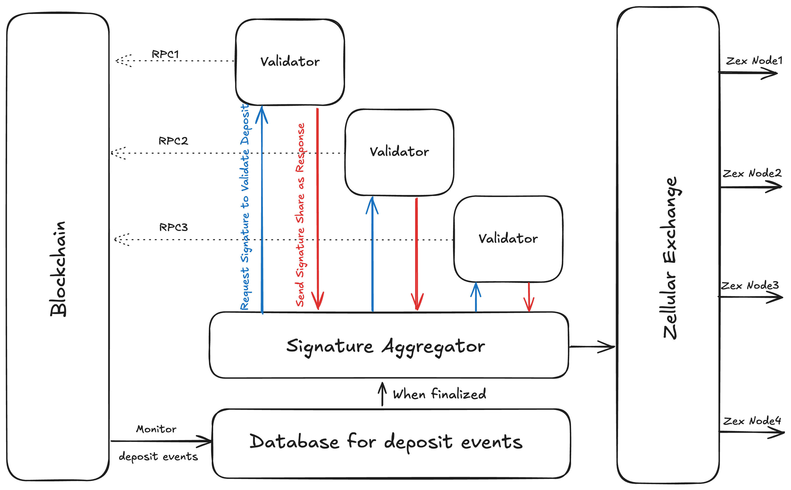

# ZexPorta

> [!NOTE]
**Project Ownership Transition**:
> This project was originally developed and maintained by **Zellular** under the MIT license until the end of 2024.
> As of **January 1, 2025**, ownership and further development of this project have been transferred to **Zex**.

> [!CAUTION]
> This code serves as a proof of concept (PoC) for the core module of the Zellular exchange. The Zellular exchange is an application designed as an example of interacting with the sequencer. **Do NOT use this code in production environments. It is intended for testnet use only.**

This is the portal module for Zellular Exchange (ZEX), which monitors the deposit and withdraw transaction to ZEX wallets and employs Pyfrost to issue a schnorr signature. The highlevel structure of this module is demonstrated in the figure below:



# Contribution guide
To contribute to this project, after making your changes, you must write your commit using `cz`.
For doing this you just have to run this command.
```sh
git add -A
cz commit
```
**Note**: please read all kind of commits carefully and be sure about choosing right commit messages.
**Note**: If your changes doesn't have any `Breaking Change` left it empty.
